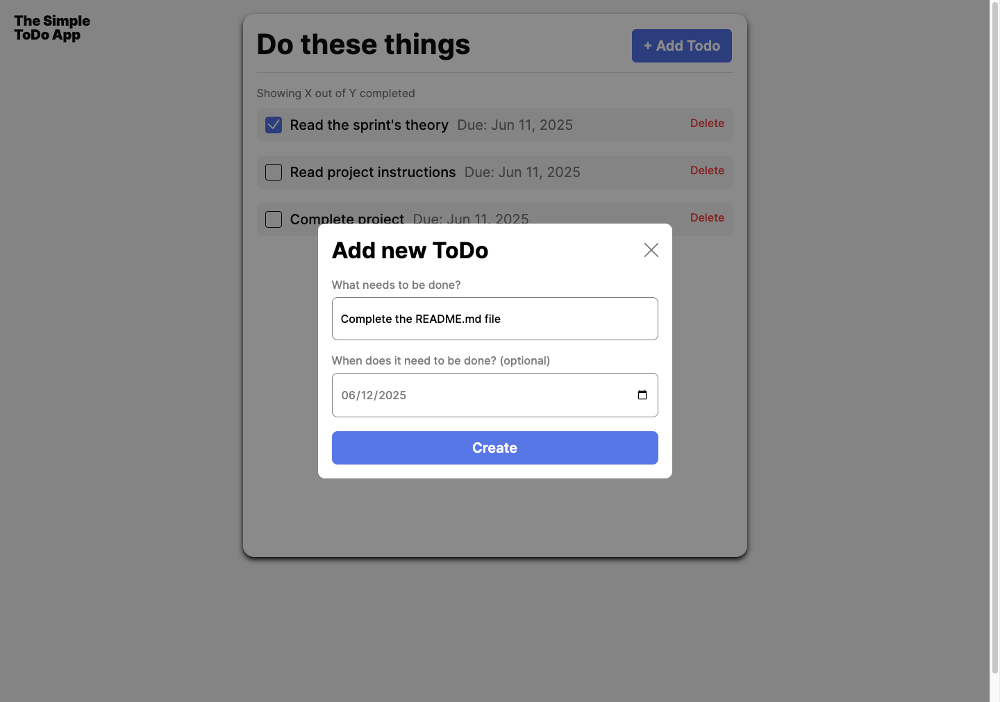
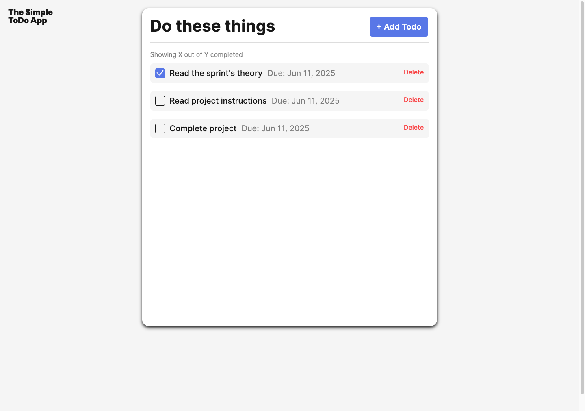

# Simple Todo App

**Todo App** is a clean and responsive task management application that allows users to keep track of their to-do items. Users can add new tasks with a name and due date, delete them when completed, and experience real-time form validation. This project emphasizes modular JavaScript architecture, accessibility, and a user-friendly design, following best practices in responsive web development.

## Functionality

- Add a new todo with task name and date
- Validate form input (name and date are required)
- Enable/disable submit button based on input validity
- Remove a todo card on click
- Automatically adjusts input date to account for local timezone
- Reset validation state after successful submission
- Disable form submission if inputs are invalid
- Close modal manually or after form submission

## Technology

- **HTML5** — Semantic markup and form structure
- **CSS3** — Responsive styling with mobile-first approach
- **JavaScript (ES6+)** — Class-based modular code for form handling and UI
- **BEM Methodology** — Block-Element-Modifier naming convention for CSS
- **DOM Manipulation** — Dynamically create and manage todo cards
- **Client-Side Validation** — Custom validation logic using the `FormValidator` class
- **UUID** — Generate unique IDs for todo items

## Deployment

This project is deployed on GitHub Pages:

- [GitHub Pages
  ](https://prakruthin.github.io/se_project_todo-app/index.html)

## Screenshots

### Add Todo Modal

### Todo List View

